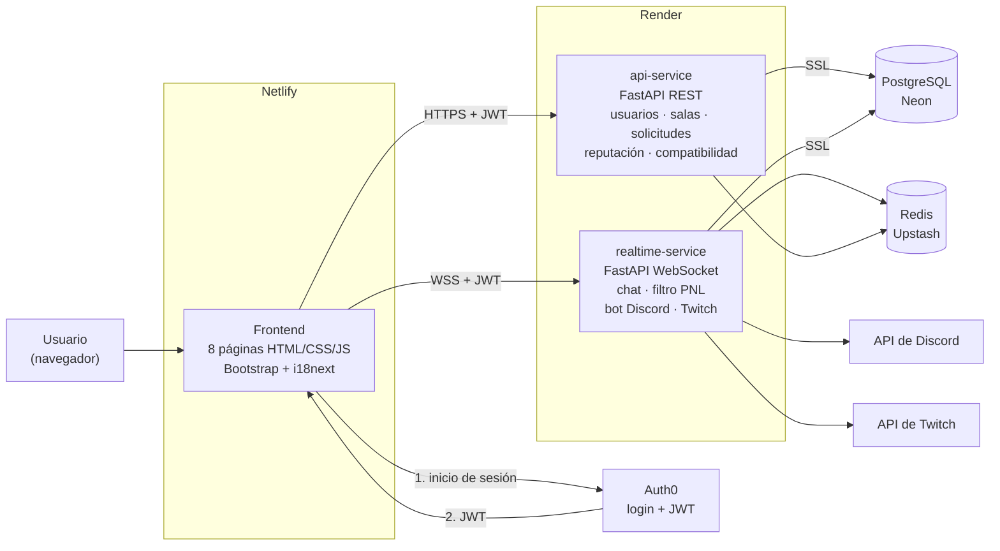
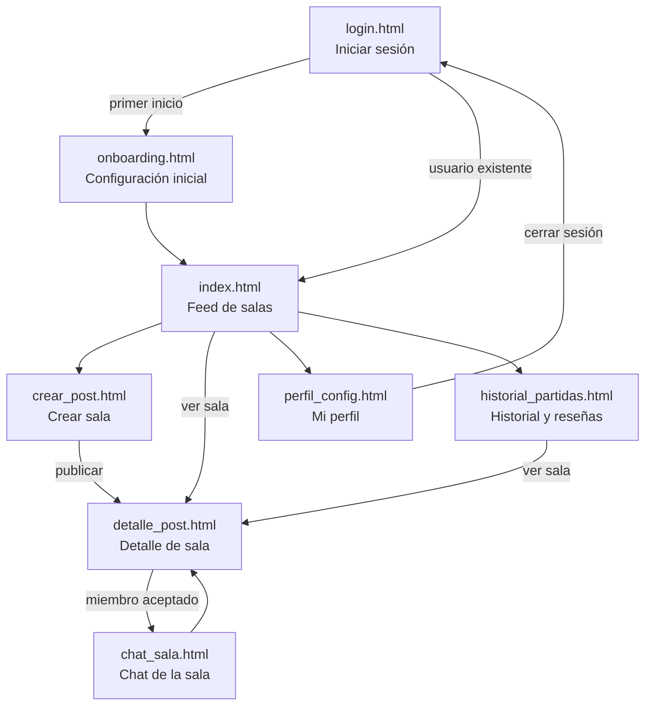

# Fase 1: Planificación y Diseño

**Proyecto:** SquadFinder LFG
**Estudiante:** Juan M. Cardona Montañez
**Curso:** COMP2053 Integrat Web Dev (Full-Stack)
**Profesora:** Milagros Donato Cintron

---

## 1. Descripción del proyecto

SquadFinder LFG ("Looking For Group") es una plataforma web donde jugadores de videojuegos publican y buscan salas para formar equipos. Cada sala indica el juego, la plataforma, los cupos, el rango, el idioma y si se requiere micrófono. Los jugadores solicitan unirse, el anfitrión acepta o rechaza, y los miembros conversan en un chat en tiempo real con un filtro anti-toxicidad que cada usuario ajusta a su gusto. Al terminar la partida, los compañeros se califican entre sí y generan un puntaje de reputación (Honor Score).

## 2. Objetivo general

Desarrollar una aplicación web Full-Stack de 8 páginas, con un backend en microservicios, que permita a los jugadores crear, buscar, gestionar y unirse a publicaciones LFG. Incluye autenticación con JWT, reputación comunitaria, chat moderado en tiempo real, soporte en español e inglés, notificaciones por Discord e integración con Twitch.

## 3. Justificación

Los jugadores de juegos multijugador tienen problemas para encontrar compañeros con el mismo nivel, horario, idioma y estilo de juego. Además, la toxicidad en los chats y la barrera del idioma arruinan la experiencia. SquadFinder resuelve esto con:

- filtros de búsqueda y un porcentaje de compatibilidad;
- un filtro de chat que cada usuario configura;
- una interfaz bilingüe;
- un sistema de reputación que premia el buen comportamiento.

## 4. Alcance del sistema

### Incluye

| Módulo | Funciones |
|---|---|
| Autenticación | Inicio de sesión con Auth0 (correo o Google), tokens JWT, protección de rutas en el frontend y en el backend |
| Perfil | Onboarding inicial, edición de preferencias (juegos, géneros, idiomas, nivel del filtro), vinculación y desvinculación de Discord, Steam, Twitch y Kick, eliminación de la cuenta |
| Salas LFG | CRUD completo de publicaciones, búsqueda con filtros y % de compatibilidad |
| Solicitudes | CRUD completo: solicitar unirse, ver solicitudes, aceptar o rechazar, retirar la solicitud |
| Reputación | Reseñas post-partida (crear, ver, editar, eliminar) y Honor Score promedio |
| Chat | Mensajes en tiempo real por WebSocket con filtro anti-toxicidad (OFF, MEDIUM, STRICT) e historial |
| Notificaciones | Mensaje directo por el bot de Discord al solicitar unirse o ser aceptado |
| Streaming | Badge "EN VIVO" para usuarios con su canal de Twitch vinculado |
| Idiomas | Interfaz completa en español e inglés (i18next) |

### No incluye (trabajo futuro)

- Inicio de sesión directo con Steam o Discord (se vinculan desde el perfil).
- Aplicación móvil nativa (la web es responsiva).
- Chat de voz.
- Pagos o suscripciones.
- Modelos de IA pesados de moderación (por ejemplo, Detoxify).

## 5. Tecnologías seleccionadas

| Capa | Tecnología | Uso |
|---|---|---|
| Frontend | HTML5, CSS3, JavaScript | 8 páginas independientes |
| Frontend | Bootstrap 5.3 | Diseño responsivo y componentes |
| Frontend | i18next | Traducción en tiempo real ES/EN |
| Backend | Python 3 y FastAPI | API REST y WebSockets |
| Backend | Pydantic | Validación de datos de entrada y salida |
| Backend | SQLAlchemy y psycopg | Conexión con PostgreSQL |
| Backend | NLTK y listas de palabras ES/EN | Filtro anti-toxicidad (PNL) |
| Base de datos | PostgreSQL (Neon) | Base de datos relacional principal, conexión con `sslmode=require` |
| Caché | Redis (Upstash) | Caché de compatibilidad y estado de Twitch, límite de mensajes |
| Autenticación | Auth0 | Inicio de sesión y emisión de JWT (OAuth 2.0) |
| Integraciones | API de Discord y API de Twitch (Helix) | Notificaciones y estado "EN VIVO" |
| Despliegue | Netlify (frontend) y Render (backend) | Publicación gratuita con HTTPS |
| Herramientas | VS Code, Git y GitHub | Desarrollo y control de versiones |

## 6. Diagrama de arquitectura

El backend se divide en **2 microservicios**:

- **api-service:** operaciones REST de corta duración.
- **realtime-service:** conexiones persistentes (WebSocket) y procesamiento de texto.

Si el chat falla o se satura, el resto de la aplicación sigue funcionando.

**Flujo de autenticación:**

1. El usuario inicia sesión en Auth0 desde `login.html`.
2. Auth0 devuelve un JWT firmado (RS256).
3. El frontend envía ese JWT en el encabezado `Authorization: Bearer <token>` de cada petición.
4. Cada microservicio verifica la firma del token con las llaves públicas de Auth0 (JWKS) antes de responder.
5. Si el token falta o no es válido, la respuesta es `401 Unauthorized`.

## 7. Diagrama general de navegación

Todas las páginas, excepto `login.html`, son **rutas protegidas**: si no hay una sesión válida, el usuario es redirigido a `login.html`. La barra de navegación (presente en todas las páginas) permite ir directamente a Inicio, Crear búsqueda, Historial y Mi perfil.
