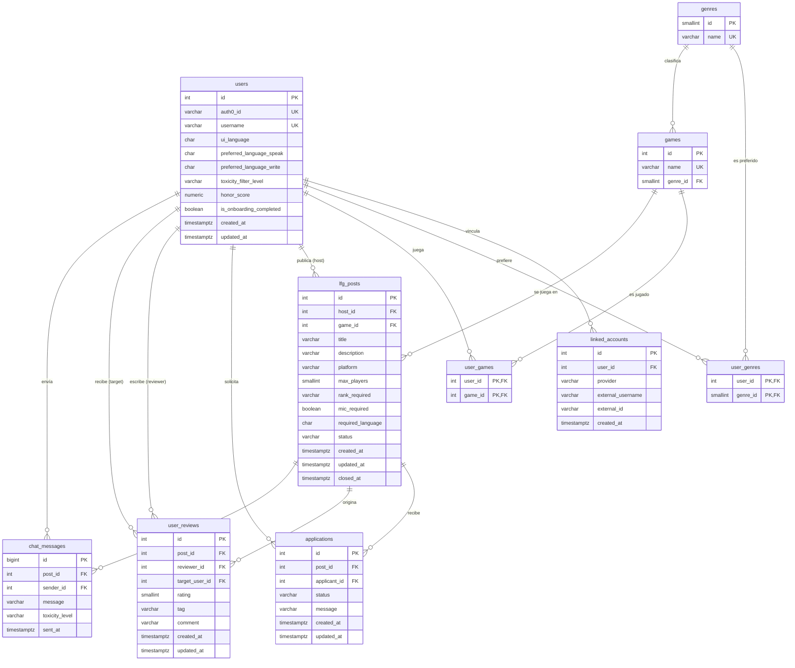

# Fase 2: Diseño de la Base de Datos

**Proyecto:** SquadFinder LFG
**Motor:** PostgreSQL 15+ (alojado en Neon)
**Scripts:** [`backend/database/schema.sql`](../backend/database/schema.sql) (creación), [`seed.sql`](../backend/database/seed.sql) (catálogos) y [`seed_demo.sql`](../backend/database/seed_demo.sql) (datos de prueba)

---

## 1. Modelo Entidad-Relación (MER)

### Relaciones

| Relación | Cardinalidad | Implementación |
|---|---|---|
| Usuario – cuentas vinculadas | 1:N | `linked_accounts.user_id` → `users.id` |
| Usuario – géneros favoritos | M:N | Tabla intermedia `user_genres` |
| Usuario – juegos habituales | M:N | Tabla intermedia `user_games` |
| Género – juegos | 1:N | `games.genre_id` → `genres.id` |
| Usuario (anfitrión) – salas | 1:N | `lfg_posts.host_id` → `users.id` |
| Juego – salas | 1:N | `lfg_posts.game_id` → `games.id` |
| Usuario – salas (como miembro) | M:N | Tabla intermedia `applications`, con atributos propios (`status`, `message`) |
| Sala – reseñas | 1:N | `user_reviews.post_id` → `lfg_posts.id` |
| Usuario – reseñas | 1:N dos veces | `reviewer_id` (quien califica) y `target_user_id` (quien es calificado) |
| Sala – mensajes | 1:N | `chat_messages.post_id` → `lfg_posts.id` |
| Usuario – mensajes | 1:N | `chat_messages.sender_id` → `users.id` |

## 2. Esquema relacional

Notación: **subrayado = PK**, *cursiva = FK*.

- **genres** (<u>id</u>, name)
- **games** (<u>id</u>, name, *genre_id*)
- **users** (<u>id</u>, auth0_id, username, ui_language, preferred_language_speak, preferred_language_write, toxicity_filter_level, honor_score, is_onboarding_completed, created_at, updated_at)
- **linked_accounts** (<u>id</u>, *user_id*, provider, external_username, external_id, created_at)
- **user_genres** (<u>*user_id*</u>, <u>*genre_id*</u>)
- **user_games** (<u>*user_id*</u>, <u>*game_id*</u>)
- **lfg_posts** (<u>id</u>, *host_id*, *game_id*, title, description, platform, max_players, rank_required, mic_required, required_language, status, created_at, updated_at, closed_at)
- **applications** (<u>id</u>, *post_id*, *applicant_id*, status, message, created_at, updated_at)
- **user_reviews** (<u>id</u>, *post_id*, *reviewer_id*, *target_user_id*, rating, tag, comment, created_at, updated_at)
- **chat_messages** (<u>id</u>, *post_id*, *sender_id*, message, toxicity_level, sent_at)

**Vista:** `v_lfg_posts` = `lfg_posts` + nombre del juego + usuario y Honor Score del anfitrión + `current_players` (calculado).

## 3. Diccionario de datos

Convenciones:

- **PK:** llave primaria.
- **FK:** llave foránea.
- **UK:** valor único.
- **Nulo:** indica si el campo acepta valores vacíos.

Todas las PK numéricas se generan automáticamente (`GENERATED ALWAYS AS IDENTITY`).

### 3.1 `users`: usuarios registrados

| Campo | Tipo | Nulo | Clave | Default | Descripción / restricciones |
|---|---|---|---|---|---|
| id | INTEGER | No | PK | auto | Identificador interno |
| auth0_id | VARCHAR(128) | No | UK | — | Identificador del usuario en Auth0 (`sub` del JWT) |
| username | VARCHAR(30) | No | UK | — | Nombre visible; 3–30 caracteres alfanuméricos o `_` |
| ui_language | CHAR(2) | No | — | `'es'` | Idioma de la interfaz: `es` o `en` |
| preferred_language_speak | CHAR(2) | No | — | `'es'` | Idioma en que habla: `es` o `en` |
| preferred_language_write | CHAR(2) | No | — | `'es'` | Idioma en que escribe: `es` o `en` |
| toxicity_filter_level | VARCHAR(6) | No | — | `'MEDIUM'` | Nivel del filtro de chat: `OFF`, `MEDIUM` o `STRICT` |
| honor_score | NUMERIC(3,2) | No | — | 0 | Promedio de reseñas recibidas (0–5); lo actualiza un trigger |
| is_onboarding_completed | BOOLEAN | No | — | FALSE | Indica si completó la configuración inicial |
| created_at | TIMESTAMPTZ | No | — | NOW() | Fecha de registro |
| updated_at | TIMESTAMPTZ | No | — | NOW() | Última modificación (trigger) |

### 3.2 `linked_accounts`: cuentas externas vinculadas

| Campo | Tipo | Nulo | Clave | Default | Descripción / restricciones |
|---|---|---|---|---|---|
| id | INTEGER | No | PK | auto | Identificador |
| user_id | INTEGER | No | FK → users | — | Dueño de la cuenta; se borra en cascada con el usuario |
| provider | VARCHAR(10) | No | — | — | `discord`, `steam`, `twitch` o `kick` |
| external_username | VARCHAR(100) | No | — | — | Nombre de usuario o canal en el servicio externo |
| external_id | VARCHAR(64) | Sí | — | — | ID numérico externo (necesario para mensajes directos de Discord) |
| created_at | TIMESTAMPTZ | No | — | NOW() | Fecha de vinculación |

Restricción: `UNIQUE (user_id, provider)`, para que haya una sola cuenta por proveedor.

### 3.3 `genres`: catálogo de géneros

| Campo | Tipo | Nulo | Clave | Default | Descripción |
|---|---|---|---|---|---|
| id | SMALLINT | No | PK | auto | Identificador |
| name | VARCHAR(50) | No | UK | — | Nombre del género (Shooter, MOBA, etc.) |

### 3.4 `games`: catálogo de juegos

| Campo | Tipo | Nulo | Clave | Default | Descripción |
|---|---|---|---|---|---|
| id | INTEGER | No | PK | auto | Identificador |
| name | VARCHAR(100) | No | UK | — | Nombre del juego |
| genre_id | SMALLINT | No | FK → genres | — | Género principal; no se puede borrar un género en uso |

### 3.5 `user_genres` y `user_games`: preferencias (M:N)

| Campo | Tipo | Nulo | Clave | Descripción |
|---|---|---|---|---|
| user_id | INTEGER | No | PK, FK → users | Usuario |
| genre_id / game_id | SMALLINT / INTEGER | No | PK, FK → genres / games | Género o juego preferido |

La PK compuesta evita que una preferencia se repita.

### 3.6 `lfg_posts`: salas de búsqueda de equipo

| Campo | Tipo | Nulo | Clave | Default | Descripción / restricciones |
|---|---|---|---|---|---|
| id | INTEGER | No | PK | auto | Identificador |
| host_id | INTEGER | No | FK → users | — | Anfitrión que creó la sala |
| game_id | INTEGER | No | FK → games | — | Juego de la sala |
| title | VARCHAR(100) | No | — | — | Título; mínimo 3 caracteres |
| description | VARCHAR(500) | Sí | — | — | Descripción opcional |
| platform | VARCHAR(12) | No | — | — | `PC`, `PlayStation`, `Xbox`, `Switch` o `Mobile` |
| max_players | SMALLINT | No | — | — | Cupos totales, entre 2 y 10 |
| rank_required | VARCHAR(50) | Sí | — | — | Rango mínimo (texto libre) |
| mic_required | BOOLEAN | No | — | FALSE | Indica si se requiere micrófono |
| required_language | CHAR(2) | No | — | `'es'` | Idioma de la sala: `es` o `en` |
| status | VARCHAR(11) | No | — | `'OPEN'` | `OPEN`, `FULL`, `IN_PROGRESS`, `CLOSED` o `CANCELLED` |
| created_at | TIMESTAMPTZ | No | — | NOW() | Fecha de creación |
| updated_at | TIMESTAMPTZ | No | — | NOW() | Última modificación (trigger) |
| closed_at | TIMESTAMPTZ | Sí | — | — | Fecha en que terminó la partida (para el historial) |

### 3.7 `applications`: solicitudes para unirse

| Campo | Tipo | Nulo | Clave | Default | Descripción / restricciones |
|---|---|---|---|---|---|
| id | INTEGER | No | PK | auto | Identificador |
| post_id | INTEGER | No | FK → lfg_posts | — | Sala solicitada |
| applicant_id | INTEGER | No | FK → users | — | Jugador que solicita |
| status | VARCHAR(9) | No | — | `'PENDING'` | `PENDING`, `ACCEPTED`, `REJECTED` o `WITHDRAWN` |
| message | VARCHAR(200) | Sí | — | — | Mensaje opcional para el anfitrión |
| created_at | TIMESTAMPTZ | No | — | NOW() | Fecha de la solicitud |
| updated_at | TIMESTAMPTZ | No | — | NOW() | Última modificación (trigger) |

Restricción: `UNIQUE (post_id, applicant_id)`, para que nadie se postule dos veces a la misma sala.

### 3.8 `user_reviews`: reseñas post-partida (Honor Score)

| Campo | Tipo | Nulo | Clave | Default | Descripción / restricciones |
|---|---|---|---|---|---|
| id | INTEGER | No | PK | auto | Identificador |
| post_id | INTEGER | No | FK → lfg_posts | — | Partida en la que jugaron juntos |
| reviewer_id | INTEGER | No | FK → users | — | Quien escribe la reseña |
| target_user_id | INTEGER | No | FK → users | — | Quien recibe la reseña |
| rating | SMALLINT | No | — | — | Calificación de 1 a 5 |
| tag | VARCHAR(20) | Sí | — | — | `GREAT_LEADER`, `FRIENDLY`, `GOOD_COMMS`, `SKILLED` o `TEAM_PLAYER` |
| comment | VARCHAR(300) | Sí | — | — | Comentario opcional |
| created_at | TIMESTAMPTZ | No | — | NOW() | Fecha de creación |
| updated_at | TIMESTAMPTZ | No | — | NOW() | Última modificación (trigger) |

Restricciones:

- `CHECK (reviewer_id <> target_user_id)`: nadie se califica a sí mismo.
- `UNIQUE (post_id, reviewer_id, target_user_id)`: una sola reseña por compañero y partida.

### 3.9 `chat_messages`: mensajes del chat de cada sala

| Campo | Tipo | Nulo | Clave | Default | Descripción / restricciones |
|---|---|---|---|---|---|
| id | BIGINT | No | PK | auto | Identificador |
| post_id | INTEGER | No | FK → lfg_posts | — | Sala del chat |
| sender_id | INTEGER | No | FK → users | — | Autor del mensaje |
| message | VARCHAR(500) | No | — | — | Texto; no puede estar vacío |
| toxicity_level | VARCHAR(6) | No | — | `'NONE'` | Resultado del filtro PNL: `NONE`, `MILD` o `SEVERE` |
| sent_at | TIMESTAMPTZ | No | — | NOW() | Fecha y hora de envío |

### 3.10 Índices

| Índice | Tabla (columnas) | Para qué sirve |
|---|---|---|
| idx_lfg_posts_status_game | lfg_posts (status, game_id) | Feed de salas abiertas filtrado por juego |
| idx_lfg_posts_host | lfg_posts (host_id) | Salas de un anfitrión (historial) |
| idx_applications_applicant | applications (applicant_id) | Salas en las que participó un usuario |
| idx_user_reviews_target | user_reviews (target_user_id) | Cálculo del Honor Score |
| idx_chat_messages_post_sent | chat_messages (post_id, sent_at) | Historial del chat en orden |

### 3.11 Triggers

| Trigger | Tabla | Acción |
|---|---|---|
| trg_*_updated_at | users, lfg_posts, applications, user_reviews | Actualiza `updated_at` en cada UPDATE |
| trg_reviews_honor | user_reviews | Recalcula `users.honor_score` al crear, editar o borrar una reseña |

## 4. Normalización

El diseño cumple la **Tercera Forma Normal (3FN)**:

- **1FN:** todos los campos son atómicos. Los géneros y juegos favoritos, que en un diseño ingenuo serían una lista dentro de `users`, están en las tablas `user_genres` y `user_games`.
- **2FN:** las tablas con PK compuesta (`user_genres`, `user_games`) no tienen atributos que dependan solo de una parte de la llave.
- **3FN:** no hay dependencias transitivas.
  - El nombre del juego y su género viven en `games` y `genres`; `lfg_posts` solo guarda `game_id`.
  - Las cuentas vinculadas tienen su propia tabla en vez de una columna por proveedor.

**Decisiones de diseño justificadas:**

1. **`current_players` se calcula, no se guarda.** Se obtiene en la vista `v_lfg_posts` como 1 (anfitrión) + solicitudes aceptadas. Guardarlo duplicaría información que se puede desincronizar.
2. **`honor_score` se guarda a propósito** (desnormalización controlada). Se muestra en casi todas las páginas, y recalcular el promedio en cada consulta sería costoso. El trigger `trg_reviews_honor` garantiza que siempre coincida con las reseñas.
3. **`toxicity_level` en lugar de un booleano `was_filtered`.** Guarda la severidad detectada (`NONE`, `MILD`, `SEVERE`). Así cada receptor ve el mensaje censurado según su propio nivel de filtro. `was_filtered` equivale a `toxicity_level <> 'NONE'`.

## 5. Cambios respecto a la propuesta inicial

| Propuesta V7 | Diseño final | Motivo |
|---|---|---|
| `discord_tag`, `steam_id`, `twitch_channel` en `users` | Tabla `linked_accounts` | Normalización; permite `DELETE /users/social/{provider}` |
| `lfg_posts.game_title` (texto) | `lfg_posts.game_id` (FK a `games`) | Evita nombres duplicados o mal escritos; permite filtrar por juego |
| `user_genres` y `user_games` sin catálogo | Tablas `genres` y `games` | Una relación M:N necesita las dos entidades |
| `lfg_posts.current_players` | Calculado en `v_lfg_posts` | Normalización |
| `chat_messages.was_filtered` | `chat_messages.toxicity_level` | Más información, para el filtro por usuario |
| `user_reviews` sin partida | `user_reviews.post_id` y restricciones | Las reseñas se atan a una partida real; se evitan duplicados y autocalificaciones |
| Sin fechas en salas y solicitudes | `created_at`, `updated_at`, `closed_at` | Historial y auditoría |

## 6. Script de creación

El script completo está en [`backend/database/schema.sql`](../backend/database/schema.sql). Orden de ejecución:

1. `schema.sql`: tablas, restricciones, índices, triggers y la vista.
2. `seed.sql`: géneros y juegos (obligatorio).
3. `seed_demo.sql`: usuarios, salas, solicitudes, reseñas y mensajes de prueba (solo en desarrollo).

Los scripts se probaron en PostgreSQL 18:

- Se crean sin errores.
- Las restricciones rechazan datos inválidos: autocalificación, calificación fuera de rango, solicitud duplicada y nombre de usuario inválido.
- El trigger de Honor Score recalcula el promedio correctamente al crear, editar y borrar reseñas.
